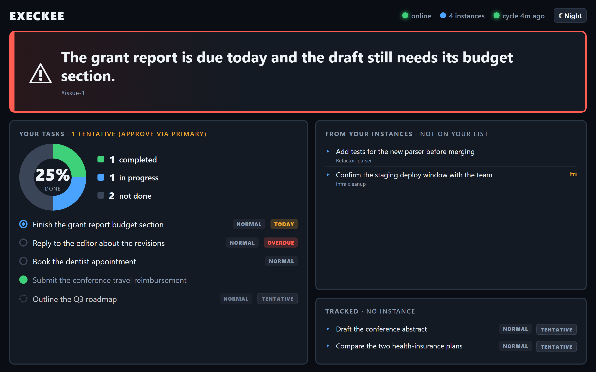
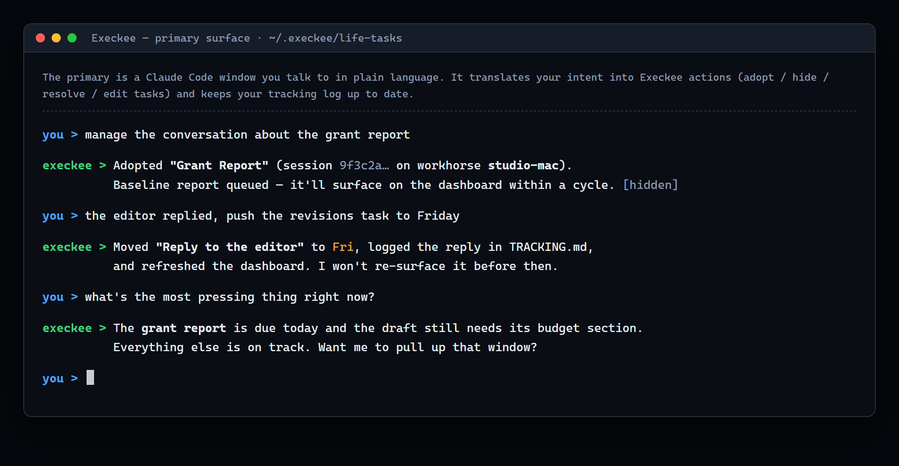

# Execkee

Execkee manages a fleet of long-lived Claude Code instances across your machines
and surfaces the single most pressing issue on a live dashboard you answer in plain
language. It is a "life manager" built on a general-purpose Claude Code fleet
supervisor.

**Who it's for:** a single operator running their own long-lived Claude Code sessions
across their own Windows/macOS machines. It is a personal rig, not a multi-user or
team product, and not a hosted service — everything runs on your own machines.





This README is written to be read before you run anything. Execkee is **invasive by
design** — it injects a session hook, drives your live Claude windows, and runs an
unattended primary with permission prompts disabled. The [trust model](#trust-model)
below states exactly what it does to your machine and to `~/.claude`. Read it first.

**How this was built.** Execkee is *vibe-coded* — built largely through AI-assisted,
conversational development with a human directing. Treat it accordingly: read the code
before you run it (it's invasive — see the trust model below), expect rough edges, and
note that it couples tightly to undocumented Claude Code internals, so a Claude Code
update can break it (the live-window probe especially).

## Contents

- [Trust model](#trust-model) — read this first
- [What it actually does to your machine and `~/.claude`](#what-it-actually-does-to-your-machine-and-claude)
- [Architecture](#architecture)
- [Platforms and prerequisites](#platforms-and-prerequisites)
- [Install](#install)
- [Driving it](#driving-it)
- [CLI reference](#cli-reference)
- [Logs](#logs)
- [Opt-outs and environment variables](#opt-outs-and-environment-variables)
- [A guided walkthrough](#a-guided-walkthrough)
- [Reset and uninstall](#reset-and-uninstall)
- [Under the hood: a Claude Code fleet supervisor](#under-the-hood-a-claude-code-fleet-supervisor)
- [Known limitations](#known-limitations)
- [Development](#development)
- [Layout](#layout)
- [License](#license)

## Trust model

**Trust model (important):** Execkee injects a session hook, can drive your live
Claude windows, and runs the primary with `--dangerously-skip-permissions`; the
live-window probe appends a short status turn to the real conversation. Everything
stays on your machines (no third party), but it's invasive by design.

If that sentence gives you pause, good — it should. The rest of this section makes
each clause precise and points at the exact code so you can audit it before you run
anything. Nothing here phones home to a server Anthropic or anyone else operates;
the only network traffic is (a) the controller↔workhorse WebSocket on your own
network and (b) whatever the `claude` CLI itself does. But "stays on your machines"
is a statement about *where the data goes*, not about how *little* the system
touches — it touches a lot.

## What it actually does to your machine and `~/.claude`

A precise inventory. Line references are to this repository so you can verify each
claim yourself.

**It launches Claude Code processes you do not see prompts for.**

- The **primary** window — your natural-language control surface — is launched with
  `--dangerously-skip-permissions`, every time, with no opt-out flag. It runs in
  `~/.execkee/life-tasks/` and is meant to act unattended. See
  `src/supervisor.js` (`launchPrimaryWindow`: both the `--resume` and fresh-seed
  launches pass `--dangerously-skip-permissions`).
- **Adopted/created instances** launch with normal permission prompts **unless** you
  pass `--full-permissions` (aliases `--skip-permissions`, `--yolo`) to `manage`, in
  which case that instance also gets `--dangerously-skip-permissions`. See
  `src/cli.js` (`manage`) and `src/workhorse/adapter-win.js` / `adapter-mac.js`
  (`launchInstance`). So the blast radius of skip-permissions is: the primary always,
  plus any instance you explicitly opt in.

**It injects a hook into every managed instance.**

- Each managed instance is launched with `claude --settings <file>`, where the file
  registers `SessionStart` and `UserPromptSubmit` hooks that run `node
  src/instance-hook.js`. The hook fires on launch/resume/compact and on every prompt
  you submit inside that window. See `adapter-win.js` / `adapter-mac.js`
  (`ensureInstanceSettings`) and `src/instance-hook.js`.
- The hook is **session-scoped**: it is passed via `--settings` for that instance
  only, written into `~/.execkee` (not `~/.claude`). It does **not** edit your global
  `~/.claude/settings.json`. (The header comment in `instance-hook.js` states this;
  the adapters confirm the settings file lives under `~/.execkee`.)
- What the hook does: captures the live `session_id` and `transcript_path` so
  tracking does not drift; intercepts the literal prompts `hide` and `close` as
  in-instance control words (they background/close the window and are blocked from
  reaching the model); passes everything else straight through. To do that, it reads
  your prompt text on every submission to check for those two words.

**It drives your live Claude windows directly (the "probe").**

- When an instance's on-disk transcript is stale — which happens routinely for
  Remote-Control-bridged sessions, see [Known limitations](#known-limitations) — the
  cycle generates a status report by driving the **live window** instead of reading
  the transcript. On Windows this is Win32 console automation (`AttachConsole` +
  `ReadConsoleOutputCharacter` / `WriteConsoleInput`); on macOS it is AppleScript
  against Terminal.app. See `src/workhorse/probe.js`, `probe-win.js`, `probe-mac.js`.
- **This appends a real turn to your conversation.** The probe injects a short prompt
  asking the model to print a marker-delimited status report, then reads it back. It
  is guarded — heuristics inject only when the window looks idle (status bar up, not
  generating), guard against injecting mid-inference, at a permission/trust prompt, or
  when the session is unchanged since the last probe — and the prompt instructs the
  model to change no files. On any unexpected behavior it falls back to the transcript
  fork. But the honest summary is: **a benign extra turn shows up in your real
  conversation history.** On by default; opt out with `EXECKEE_PROBE_REPORTS=0`.

**It reports on conversations by forking their transcripts.**

- The 30-minute cycle reads each instance's transcript and runs
  `claude -p --resume <id> --fork-session --no-session-persistence` (with model
  fallbacks) to synthesize a status report. That loads the conversation into a model
  context. It is local, but it means Execkee reads the full content of the Claude
  sessions it manages. See `src/cowork.js` and `src/workhorse/reporter.js`.

**It syncs two files across your machines, bidirectionally — and writes them into
`~/.claude`.**

- With more than one machine connected, Execkee keeps `~/.claude/settings.json` and
  your **global** `~/.claude/CLAUDE.md` in sync across all nodes (last-write-wins by
  mtime, content-hash loop-guarded; a `.execkee-bak` backup is written before each
  overwrite). These two files in your real `~/.claude` are written by Execkee.
- The sync is an **explicit allowlist of exactly those two basenames** directly under
  `~/.claude` — no globbing, no recursion, no directories. By construction it cannot
  touch `.credentials.json`, `.claude.json`, `sessions/`, `projects/`,
  `history.jsonl`, `cache/`, etc. See `src/common/settings-sync.js` (`SYNCED_FILES`,
  `isAllowed`). On by default; opt out with `EXECKEE_SETTINGS_SYNC=0`.

**It enables Claude Code's native Remote Control by default.**

- Managed instances and the primary launch with `--remote-control`, which makes each
  window drivable from claude.ai/code and the Claude mobile app. When a remote client
  attaches, your conversation routes through Anthropic's Remote Control bridge — the
  same path Claude Code itself uses for that feature. It requires a claude.ai OAuth
  login (not an API key) and a Pro/Max plan, and degrades gracefully if ineligible
  (the window still launches normally). On by default; opt out with
  `EXECKEE_REMOTE_CONTROL=0`. See `src/common/config.js` (`REMOTE_CONTROL_ENABLED`).

**Where data lives.** All of Execkee's own state — tracking, the shared store, the
life-tasks folder, logs, the generated hook-settings and launcher files — lives under
`~/.execkee`. Nothing is written into the repo. Logs (full process stdout/stderr plus
a tail of the primary's conversation) rotate under `~/.execkee/logs/`.

**The controller↔workhorse link is unauthenticated.** The WebSocket on port 7700 has
no auth; it relies on running over a private network (a LAN behind a firewall, or
Tailscale). Instance ids and window/PID handles arriving over that link are
input-validated before they reach any shell or AppleScript (see the allowlist checks
in `adapter-mac.js`), but the channel itself is trusted. Do not expose 7700 to the
public internet.

## Architecture

Two roles.

- **Controller** (Windows). Runs the **server** — a WebSocket hub on **7700**, an
  HTTP + SSE dashboard on **7701**, and a periodic **cycle** (every 30 minutes) —
  plus the **primary** Claude Code window you talk to. By default the controller is
  **brain-only**: it runs no instances itself. Pass `-WithLocalWorkhorse` (or set
  `EXECKEE_LOCAL_WORKHORSE=1`) for a co-located workhorse if you want everything on
  one machine.
- **Workhorse** (Windows or macOS). Runs and reports the managed Claude Code
  instances on that machine, as real OS windows it can launch, hide, show, and kill.
  It self-registers upward; the controller needs no configuration to accept it.

```
                 +-------------------------------------------------+
                 |  CONTROLLER (Windows)                           |
                 |   - WebSocket hub            ......  port 7700  |
                 |   - HTTP/SSE dashboard       ......  port 7701  |
                 |   - periodic "cycle" (every 30 min)             |
                 |   - "primary" Claude Code window (you talk here)|
                 +-------------------------------------------------+
                        |  socket (works well over Tailscale)
            +-----------+-----------------------+
            |                                   |
   +-------------------+              +-----------------------------+
   | WORKHORSE (Win)   |              | WORKHORSE (macOS)           |
   |  runs + reports   |              |  runs + reports             |
   |  managed instances|              |  managed instances          |
   |                   |              |  (experimental — see below) |
   +-------------------+              +-----------------------------+
```

The two connect over a socket. It works well over **Tailscale** — point the workhorse
at the controller's Tailscale IP rather than its LAN IP if that is how your machines
reach each other. For a same-LAN setup instead, open inbound TCP 7700 on the
controller (see [`CONTROLLER-SETUP.md`](./CONTROLLER-SETUP.md) §6); over Tailscale you
skip the firewall rule. Sessions are discovered per-machine (each workhorse enumerates
its own `~/.claude/projects`) and can be adopted across hosts; `manage` auto-routes to
the workhorse that owns the session.

The cycle collects each instance's status — from its transcript, or by probing the
live window — and synthesizes it into one dashboard "sentence": the single most
pressing thing, which you resolve in natural language. The dashboard supports a
rotated/portrait mode for a turned screen via `?rotate=left` (or `right`, or `off`),
which sticks per browser.

Node.js (ESM), no build step — everything runs with `node`. The `claude` CLI must be
on `PATH`.

## Platforms and prerequisites

Verified against the workhorse adapters (`src/workhorse/adapter.js` and the platform
files it dispatches to).

| Role | Windows | macOS |
|------|:-------:|:-----:|
| Controller + primary | yes | — |
| Workhorse | yes | yes (experimental) |

- **Windows 10/11** — controller and/or workhorse. The adapter is `adapter-win.js`
  (PowerShell + Win32 console-window control).
- **macOS** — workhorse only; the controller and primary surface run on Windows. The
  macOS adapter (`adapter-mac.js`) drives Terminal.app via AppleScript. Caveat worth
  knowing before you rely on it: per `STATUS.md` KI-8 the macOS path has been
  statically verified and adversarially reviewed but **not yet exercised on a physical
  Mac** — treat it as experimental and needing a live shakedown. Expect a one-time
  macOS Automation (TCC) consent prompt the first time it drives Terminal.
- Linux is **not** supported — the dispatcher accepts only `win32` and `darwin` and
  throws otherwise (`adapter.js`).

Prerequisites on each machine:

- **Node.js 18+** on `PATH` (Execkee itself runs on Node; the CLI uses global
  `fetch`, which is stable from Node 18).
- The **`claude`** CLI on `PATH`, logged in once via browser (Claude Pro/Max or
  Console). Used throughout — the primary surface, managed instances, report forks,
  the daily-plan guesses, and probe reports. Remote Control additionally requires a
  claude.ai OAuth login, not an API key.

Two default-on behaviors with prerequisites are worth flagging here (full detail in
the [trust model](#trust-model)): **Remote Control** needs a claude.ai OAuth login on
a Pro/Max plan (opt out `EXECKEE_REMOTE_CONTROL=0`), and **settings sync** mirrors
`~/.claude/settings.json` + your global `~/.claude/CLAUDE.md` across connected machines
(opt out `EXECKEE_SETTINGS_SYNC=0`).

## Install

The one-line bootstrap installs a portable Node, the `claude` CLI, and (on Windows) a
portable Git if missing — no admin, no `winget`/Homebrew — then `git clone`s Execkee
into `~/Execkee`, runs `npm install`, and launches. It is a real git working copy; on
re-run it `git pull --ff-only`s. It also updates your **user PATH** and, on Windows,
sets the CurrentUser PowerShell execution policy to `RemoteSigned` so the
freshly-installed tools and launcher scripts can run.

> **Prefer to read it first?** The scripts are short — download `bootstrap.ps1` /
> `bootstrap.sh` and run them locally instead of piping to a shell:
> `powershell -ExecutionPolicy Bypass -File .\bootstrap.ps1` (Windows) or
> `bash bootstrap.sh --controller <controller-ip>:7700` (macOS). For the manual,
> step-by-step controller path see [`CONTROLLER-SETUP.md`](./CONTROLLER-SETUP.md)
> (note: that doc predates the brain-only default and shows a co-located workhorse as
> the default — `STATUS.md` and this README are authoritative for current defaults).

> **First run may need a second pass.** On a truly bare machine the bootstrap may
> finish installing a dependency and ask you to **reopen the terminal and re-run the
> same command** (Windows, when a just-installed tool isn't on `PATH` yet), or to
> finish a **Xcode Command Line Tools** install and re-run (macOS, if `git` is absent).
> Complete the browser `claude` login in a normal interactive console.

**Controller (Windows), one line in PowerShell:**

```powershell
irm https://raw.githubusercontent.com/cc-wr/Execkee/master/bootstrap.ps1 | iex
```

You complete a one-time `claude` browser login when prompted (do this in an
interactive PowerShell window). To run everything on a single machine, append
`-WithLocalWorkhorse`.

**Workhorse on a second Windows machine:**

```powershell
& ([scriptblock]::Create((irm https://raw.githubusercontent.com/cc-wr/Execkee/master/bootstrap.ps1))) -Mode workhorse -ControllerAddress <controller-ip>:7700
```

**Workhorse on macOS (experimental — see [Platforms](#platforms-and-prerequisites)):**

```bash
curl -fsSL https://raw.githubusercontent.com/cc-wr/Execkee/master/bootstrap.sh \
  | bash -s -- --controller <controller-ip>:7700 --name "Mac-Workhorse"
```

> **macOS one-time permission and login:** the workhorse drives Terminal.app via
> AppleScript. The first time, macOS asks *"… wants to control Terminal.app"* — click
> **OK** once, at the Mac's screen (a headless/login-time first run fails silently
> until approved). Run `./execkee-workhorse.sh` manually once and approve it before
> relying on login-startup. Note also: a macOS workhorse **registers with the
> controller even before you log in to `claude`**, but it cannot launch or report on
> instances until you complete the browser login (`claude`) on that Mac.

If you already have the repo and the prerequisites, skip the bootstrap and start
directly.

**Start the controller** (from inside the repo):

```powershell
.\execkee-controller.ps1                      # brain-only (default)
.\execkee-controller.ps1 -WithLocalWorkhorse  # also run a co-located workhorse
```

On first run it installs dependencies (`npm install`), then starts and keeps alive the
server and the primary window. **By default the controller is brain-only — it runs no
workhorse**, so until a workhorse connects, `status` shows none and you can't manage
instances. For a single-machine setup, start with `-WithLocalWorkhorse` (or add a
separate workhorse, below). The dashboard opens at **http://localhost:7701**. Leave the
window open; **Ctrl+C** stops the whole system.

**Add a workhorse (machine 2+), day-2 starts:**

```powershell
.\execkee-workhorse.ps1 -ControllerAddress <controller-host>:7700 -Name "Work-Laptop"   # Windows
```

```bash
./execkee-workhorse.sh --controller <controller-host>:7700 --name "Mac-Workhorse"        # macOS
```

To start at login, `scripts/install-startup.ps1` (Windows — add `-Mode workhorse
-ControllerAddress <ip>:7700 -Name "…"` on a workhorse) or
`scripts/install-startup.sh --controller <host>:7700` (macOS LaunchAgent) installs a
per-user, no-admin startup launcher (`-Uninstall` / `--uninstall` removes it). A
step-by-step bare-Windows-machine controller setup, including the optional inbound-7700
firewall step, is in [`CONTROLLER-SETUP.md`](./CONTROLLER-SETUP.md).

**Verify it's up:** the browser at http://localhost:7701 shows the dashboard, the
primary window greets you with current status, and `node src/cli.js status` lists
connected workhorses and instances (none until you start a workhorse or used
`-WithLocalWorkhorse`).

## Driving it

Four ways in, all acting on the same system.

**1. Talk to the primary window** in natural language — it translates your words into
system actions:

- "pull up the claude code about the billing migration"
- "hide the current one"
- "manage the conversation about the tax filing"
- "the auth thing is handled, I merged the fix" (the primary resolves the displayed
  issue only if your message actually resolves it)
- "add: file the quarterly taxes, due yesterday, high priority"
- "log this for later: the dashboard sentence wraps awkwardly on mobile" (records to
  the improvement backlog)

**2. Use the CLI** from a terminal on the controller machine — see the
[CLI reference](#cli-reference). (The CLI talks to the controller's HTTP API on
`localhost:7701`, so it must be run on the controller, not on a workhorse-only host.)

**3. Use the live web dashboard** at http://localhost:7701.

**4. Use your phone** via Claude Code's native Remote Control (on by default; see the
[trust model](#trust-model)).

**Inside any managed instance window**, typing `hide` backgrounds it and typing
`close` closes it (recognized as an intentional close, not a crash). On Windows the
window's close button is disabled so it cannot accidentally kill an instance; on macOS
Terminal exposes no scriptable equivalent, so a closed window is treated as a crash and
relaunched (see `STATUS.md` KI-8).

**Adopting a session** produces a full baseline report by default and auto-runs a
cycle so the report appears at once. Use `--from-now` to adopt deltas-only.

## CLI reference

Every command below is present in `src/cli.js`. Run from a terminal on the controller
machine (the CLI talks to the controller's HTTP API on `localhost:7701`). Run
`node src/cli.js` with no arguments for the full help.

```
node src/cli.js status                        workhorses + instances
node src/cli.js instances                      detailed instance list
node src/cli.js sessions [--all]               adoptable sessions per workhorse (--all incl. managed)
node src/cli.js manage <session-id> [name]     adopt a session; auto-routes to its workhorse
                                                 (--from-now deltas-only, --open, --on <wh>,
                                                  --path <p>, --full-permissions)
node src/cli.js create "<name>" [path]         new managed instance (--on <wh>)
node src/cli.js foreground <instance-id>       pull an instance to the front
node src/cli.js hide <instance-id>             background an instance
node src/cli.js close <instance-id>            close an instance (session stays re-adoptable)
node src/cli.js unmanage <instance-id>         release / un-adopt (leaves the window running)

node src/cli.js sentence                       current dashboard sentence
node src/cli.js resolve <issue-id> "<msg>"     resolve a dashboard issue
node src/cli.js dashboard                      raw dashboard data (JSON)
node src/cli.js run-cycle                      force a cycle now (regenerate the dashboard)
node src/cli.js refresh-tasks                  refresh the dashboard task list (no cycle)

node src/cli.js plan                           today's plan (confirmed + tentative guesses, with ids)
node src/cli.js approve-task <id> | --all      approve a tentative guessed task (promotes to backlog)
node src/cli.js reject-task <id>               drop a tentative guessed task
node src/cli.js regenerate-guesses             force a fresh tracked-file task guess now
node src/cli.js schedule-guess "<text>" --on YYYY-MM-DD [--until YYYY-MM-DD] [--horizon]
node src/cli.js unschedule-guess <id|text>
node src/cli.js scheduled-guesses
node src/cli.js defer "<topic>" [--until YYYY-MM-DD]   put a topic on hold (its surfaced tasks stop appearing)
node src/cli.js undefer <id|topic>             lift a deferral
node src/cli.js deferrals                      list active deferrals

node src/cli.js issue add "<text>"             log an Execkee improvement/bug to the backlog
node src/cli.js issue [all]                    list open (or all) backlog issues
node src/cli.js issue done <id>                mark a backlog issue resolved

node src/cli.js logs                           list log files (sizes + mtimes)
node src/cli.js logs <name> [--tail N]         tail a log (controller/workhorse/supervisor/primary-chat)
```

**The daily plan** resets each local day: completed items archive, incomplete
confirmed ones carry forward, and Execkee guesses a horizon of tasks from your tracked
files once a day, tagging which are achievable today. Guesses are **tentative
(LLM-generated)** until you **approve them via the primary** (`approve-task` /
`reject-task`) — nothing LLM-guessed enters your confirmed backlog without your
approval. `schedule-guess` queues a guess to surface on a future date; `defer` holds a
topic so its surfaced tasks stop appearing until you lift it.

## Logs

Each long-running process tees its full stdout/stderr to a rotating file under
`~/.execkee/logs/`:

- `controller.log` — server / hub / dashboard / cycle
- `workhorse.log` — the workhorse subcontroller
- `supervisor.log` — the process supervisor
- `primary-chat.log` — the primary's conversation (readable USER/ASSISTANT turns)

Inspect with `node src/cli.js logs` (list) or `node src/cli.js logs controller --tail
100`, or read the files directly. Disable with `EXECKEE_LOG=off`; the per-file
rotation cap is `EXECKEE_LOG_MAX_BYTES`.

## Opt-outs and environment variables

Defined in `src/common/config.js`. All default **on** unless noted.

| Variable | Default | Effect |
|---|---|---|
| `EXECKEE_REMOTE_CONTROL` | on | `0` stops launching instances/primary with `--remote-control`. |
| `EXECKEE_PROBE_REPORTS` | on | `0` disables the live-window probe (no extra conversation turn; falls back to the transcript fork). |
| `EXECKEE_SETTINGS_SYNC` | on | `0` disables syncing `settings.json` / global `CLAUDE.md` across machines. |
| `EXECKEE_LOG` | on | `off` disables process/chat logging. |
| `EXECKEE_LOG_MAX_BYTES` | — | Per-log rotation cap. |
| `EXECKEE_LOCAL_WORKHORSE` | off | `1` runs a co-located workhorse on the controller (same as `-WithLocalWorkhorse`). |
| `EXECKEE_DATA_DIR` | `~/.execkee` | Override the data directory (used for same-box simulation). |
| `EXECKEE_HEARTBEAT_MS` | 30000 | Workhorse heartbeat interval; ~3 missed intervals drops a connection. |

There is **no** environment variable that turns off `--dangerously-skip-permissions`
on the primary. If you are not comfortable running an unattended skip-permissions
Claude window, Execkee is not for you.

## A guided walkthrough

This assumes a workhorse exists — start the controller with `-WithLocalWorkhorse`
(single machine) or add a workhorse first, or the steps below have nothing to manage.

1. Start the controller (`-WithLocalWorkhorse` for a single box). Talk to the primary,
   or use the CLI.
2. Add a task — tell the primary "add: file the quarterly taxes, due yesterday, high
   priority" (it writes the life-tasks store).
3. Adopt a real session: `node src/cli.js sessions`, then `node src/cli.js manage <id>
   "Some Work"` (a full baseline report + an auto-cycle happen automatically, so the
   report appears at once).
4. Watch the dashboard show a conversational sentence for the top issue. To force a
   cycle any time: `node src/cli.js run-cycle`.
5. Resolve it — via the primary, or `node src/cli.js resolve <issue-id> "done"` — and
   watch the dashboard promote the next sentence live.

## Reset and uninstall

```powershell
.\scripts\reset.ps1
```

Stops Execkee's Node processes and clears the tracking file + shared store under
`~/.execkee`. It leaves your life-tasks folder and your on-disk Claude sessions
intact, and it does not close already-open managed-instance windows (close them
manually if needed).

To remove Execkee entirely: stop the controller (Ctrl+C), run the startup installer
with `-Uninstall` / `--uninstall` if you registered login-startup, delete the
`~/Execkee` repo, and delete the `~/.execkee` data directory. The two synced files it
wrote into `~/.claude` (`settings.json`, `CLAUDE.md`) are your own files and are left
in place; the `.execkee-bak` backups beside them can be removed.

## Under the hood: a Claude Code fleet supervisor

Execkee is a life manager, but the machinery underneath is general-purpose — a
supervisor for a fleet of long-lived Claude Code instances across your machines. If
you run many Claude Code sessions for anything (not just life-tracking), the same core
is reusable:

- Persistent, supervised instances — launch or adopt sessions and keep them alive;
  crashes are detected and relaunched, resuming the live conversation.
- Multi-machine — a controller coordinates workhorse machines over a socket (works
  well over Tailscale); sessions are discovered and adopted across hosts.
- Drive from anywhere — a CLI, a live web dashboard, a natural-language "primary"
  window, or your phone via Claude Code's native Remote Control.
- Non-disruptive status — a periodic cycle collects each instance's status (from its
  transcript, or by probing the live window) and synthesizes it into one view, without
  interrupting your work.
- Settings sync — your ~/.claude/settings.json and global CLAUDE.md stay in sync
  across every machine.

The life-management layer (tasks, the daily plan, the dashboard sentence) sits on top
of that core. The core is reusable for other long-lived-fleet use-cases; only the
life-management synthesis layer (the cycle's synthesis and the dashboard) is specific
and would be the part you swap.

## Known limitations

Documented in `STATUS.md` (the "Known issues" section). The honest state:

- **Remote Control freezes the local transcript (KI-9).** When an instance is actually
  bridged through Remote Control (a remote client attaches), Claude Code streams the
  conversation through the cloud bridge and stops appending real turns to the local
  `.jsonl`. Transcript-based reporting then sees no change and would silently skip —
  which is precisely why the live-window **probe** exists and is on by default. Remote
  Control and local-transcript reporting are effectively mutually exclusive for the
  same instance under current Claude Code behavior.
- **Large/active transcripts can't be fork-reported (KI-7).** The fork-report loads
  the entire transcript into a model context; a long-lived window's `.jsonl` can grow
  past the context window, so the biggest sessions are the hardest to summarize via the
  fork path. The probe sidesteps this for live windows; a general fix is not yet chosen.
- **macOS is experimental — unverified on hardware (KI-8).** The macOS workhorse and
  probe are implemented, statically checked, and adversarially reviewed, but not yet run
  on a physical Mac. Expect a one-time TCC Automation consent, and a parity gap: on
  macOS a user *can* close an instance window (it is then treated as a crash and
  relaunched).
- **Supervised-while-running only.** The system lives while the controller window is
  open and survives logon via the optional startup installer
  (`scripts/install-startup.ps1` / `.sh`), but a before-logon Windows service is still
  pending (KI-3). Closing the server doesn't always close the primary window (KI-5).
- **The controller↔workhorse WebSocket is unauthenticated.** It relies on a private
  network (LAN/Tailscale). Do not expose port 7700 publicly. See the
  [trust model](#trust-model).

## Development

ESM, no build step — run everything with `node`. One runtime dependency (`ws`). There
is no automated test suite; changes are verified by running the controller plus a
workhorse and watching the dashboard. The repo is a single-operator project; the source
is at [github.com/cc-wr/Execkee](https://github.com/cc-wr/Execkee).

## Layout

```
execkee-controller.ps1    one-command controller launcher (Windows)
execkee-workhorse.ps1     one-command workhorse launcher (Windows, machine 2+)
execkee-workhorse.sh      one-command workhorse launcher (macOS, machine 2+)
bootstrap.ps1 / .sh       fresh-machine installers (Windows / macOS workhorse)
src/supervisor.js         keeps server + (optional local workhorse) + primary alive
src/server/               WebSocket hub, dashboard (HTTP + SSE), cycle wiring
src/workhorse/            subcontroller, report fork, instances, and the OS adapters:
  adapter.js                platform dispatcher (win32 -> adapter-win, darwin -> adapter-mac)
  adapter-win.js            Windows window/process control (PowerShell + Win32)
  adapter-mac.js            macOS window/process control (Terminal.app via AppleScript)
  probe.js / probe-win.js / probe-mac.js   live-window "probe" report (on by default;
                            opt out with EXECKEE_PROBE_REPORTS=0)
src/cowork.js             the 30-minute cycle (synthesis -> sentences)
src/common/               config, settings sync, logger, store, protocol, tracking
src/instance-hook.js      session-scoped in-instance hook (hide/close + session capture)
src/cli.js                operator CLI
dashboard/index.html      the live dashboard (?rotate=left|right|off)
scripts/reset.ps1         clean-slate helper (Windows)
scripts/install-startup.* login-startup installer (Windows .ps1 / macOS .sh LaunchAgent)
docs/screenshots/         the dashboard + primary screenshots shown above
```

Companion docs: [`CONTROLLER-SETUP.md`](./CONTROLLER-SETUP.md) (step-by-step
bare-Windows controller setup — note it predates the brain-only default and still shows
a co-located workhorse as the default; `STATUS.md` and this README are authoritative),
[`STATUS.md`](./STATUS.md) (current status, phase history, and the numbered
known-issues list), and
[`claude-life-manager-architecture.md`](./claude-life-manager-architecture.md) (the
full design — aspirational in places, e.g. it sketches a Linux/tmux adapter that is not
yet built; `STATUS.md` is authoritative for what actually ships).

Ports: WebSocket **7700**, dashboard **7701**. Data lives in **`~/.execkee`** (never
in the repo).

## License

MIT © 2026 cc-wr. Repository:
[github.com/cc-wr/Execkee](https://github.com/cc-wr/Execkee) (default branch `master`).
